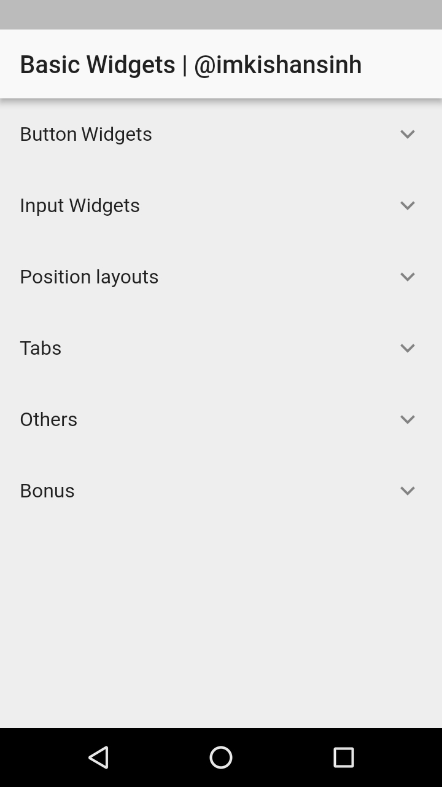

# Flutter Basic Widgets
    Very basic flutter widgets.

## How add your own example ?
    1. Import your example.dart file in main.dart
    2. Must have routeName static final String variable in your example file.
		static final String routeName = "/unqiueRouteName";
    3. Add your route in main.dart file. ( _getRoutes() )
    4. Import your example.dart file in ExpandableListDemo.dart
    5. Add single list item in ExpandableListDemo.dart data variable. (final List<Entry> data)
		Entry('Single',ClassName.routeName),

## What you get extra on this project
    Custom password visiblity icon over the password textfield.
    Try to play with columnpro and rowpro.
    BottomAppBar notch with FAB button.
    SignUp page with MediaQuery.

## Getting Started

For help getting started with Flutter, view our online
[documentation](https://flutter.io/).

